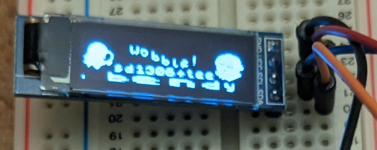

# Teensy 2.0 & SSD1306 OLED display test

This is my little program to drive an SSD1306-based 128x32 OLED
display from a Teensy 2.0 (atmega32u4-based board) using I2C.

## Hardware

The hardware is very simple - a [Geekcreit 0.91 Inch 128x32 I2C blue
OLED
display](https://www.banggood.com/Geekcreit-0_91-Inch-128x32-IIC-I2C-Blue-OLED-LCD-Display-DIY-Module-SSD1306-Driver-IC-DC-3_3V-5V-p-1140506.html)),
driven by a Teensy 2.0. The hardware side is extremely simple - drop
them both in a breadboard, wire up power and ground, connect `SCL` to
`D0` and `SDA` to `D1`.

## Software tooling

As I'm developing on a Mac, I installed [Crosspack
AVR](https://www.obdev.at/products/crosspack/index.html). I'm using
[`teensy_loader_cli`](https://github.com/PaulStoffregen/teensy_loader_cli)
to program the Teensy, and
[`hid_listen`](https://www.pjrc.com/teensy/hid_listen.html) from
pjrc.com to supply debug output. The utilities source and Makefile
come from pjrc's ["blinky"
example](https://www.pjrc.com/teensy/blinky.zip).

## The code

 * This is my first AVR coding project, so I've made plenty of use of
   the [ATmega32U4
   datasheet](https://ww1.microchip.com/downloads/en/DeviceDoc/Atmel-7766-8-bit-AVR-ATmega16U4-32U4_Datasheet.pdf).
 * The Geekcreit module has no data sheet, so I've relied on the
   [SSD1306
   datasheet](https://cdn-shop.adafruit.com/datasheets/SSD1306.pdf),
   which I've included in the repo, since it's handy and not quite as
   common as the AVR.
 * This is my first attempt at bit-banging IIC (my previous Z80-based
   computer talked to its SD card using bit-banged SPI, though!). I
   found https://learn.sparkfun.com/tutorials/i2c/all to be a very
   helpful tutorial.
 * While I'm writing the interface code from scratch (where's the
   sense of achievement, otherwise? ;), it's useful to refer to
   others' work, making sure you're not on the completely wrong track.
   https://github.com/olikraus/u8glib/blob/master/csrc/u8g_dev_ssd1306_128x32.c
   was helpful while attempting to get the first bring-up working.
